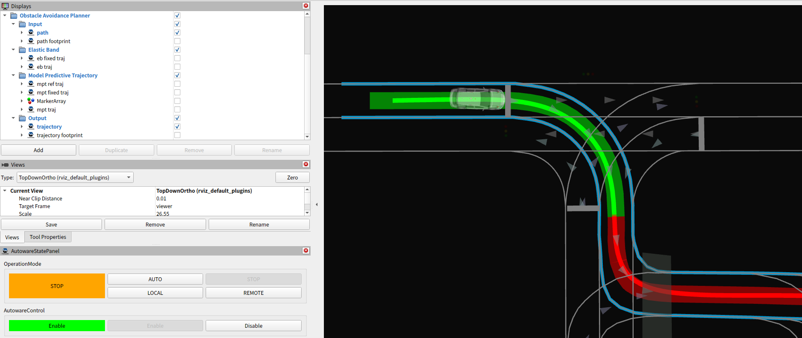
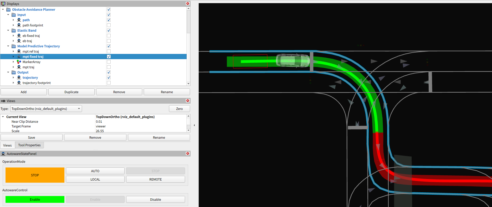
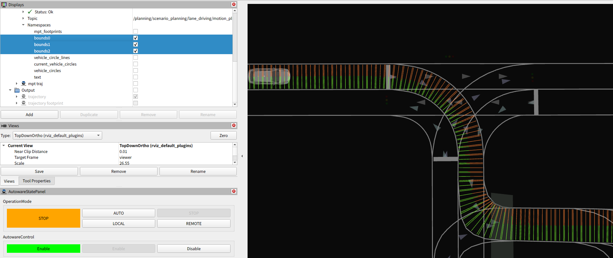
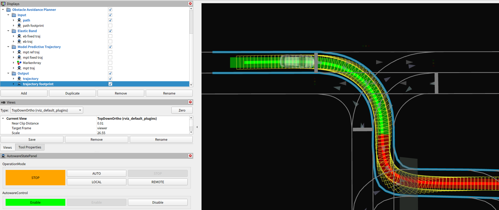

# Debug

## Debug visualization

The visualization markers of the planning flow (Input, Elastic Band, Model Predictive Trajectory, and Output) are explained here.

All the following markers can be visualized by

```bash
ros2 launch obstacle_avoidance_planner launch_visualiation.launch.xml vehilce_model:=sample_vehicle
```

The `vehicle_model` must be specified to make footprints with vehicle's size.

### Input

- **Path**
  - The path generated in the `behavior` planner.
  - The semitransparent and thick, green and red band, that is visualized by default.


- **Path Footprint**
  - The path generated in the `behavior` planner is converted to footprints.
  - NOTE:
    - Check if there is no high curvature.
    - The path may be outside the drivable area in some cases, but it is okay to ignore it since the `behavior` planner does not support it.


- **Drivable Area**
  - The Drivable area generated in the `behavior` planner.
  - The skyblue left and right line strings, that is visualized by default.
  - NOTE:
    - Check if the path is almost inside the drivable area.
      - Then, the `obstacle_avoidance_planner` will try to make the trajectory fully inside the drivable area.
    - During avoidance or lane change by the `behavior` planner, please make sure that the drivable area is expanded correctly.



### Elastic Band (EB)

- **EB Fixed Trajectory**
  - The fixed trajectory points as a constraint of elastic band.


- **EB Trajectory**
  - The optimized trajectory points by elastic band.


### Model Predictive Trajectory (MPT)

- **MPT Reference Trajectory**
  - The reference trajectory points of model predictive trajectory.


- **MPT Fixed Trajectory**
  - The fixed trajectory points as a constraint of model predictive trajectory.



- **Boundaries' Width**
  - The boundaries' width is calculated from the drivable area line strings.



- **Vehicle Circles**
  - The vehicle's shape is represented by a set of circles.
  - The `obstacle_avoidance_planner` will try to make the these circles inside the above boundaries' width.


- **Vehicle Circles on Trajectory**
  - The vehicle's circles on the MPT trajectory.
  - Check if the circles are not so big compared to the road's width.


- **MPT Trajectory**
  - The optimized trajectory points by model predictive trajectory.
  - The footprints are supposed to be fully inside the drivable area.


### Output

- **Trajectory**
  - The output trajectory.
  - The dark and thin, green and red band, that is visualized by default.


- **Trajectory Footprint**
  - The output trajectory is converted to footprints.



## Calculation time

The `obstacle_avoidance_planner` consists of many functions such as boundaries' width calculation, reference path smoothing, collision-free planning, etc.
We can see the calculation time for each function as follows.

### Raw data

Enable `option.enable_calculation_time_info` or echo the topic as follows.

```sh
$ ros2 topic echo /planning/scenario_planning/lane_driving/motion_planning/obstacle_avoidance_planner/debug/calculation_time --field data
---
        insertFixedPoint:= 0.008 [ms]
        getPaddedTrajectoryPoints:= 0.002 [ms]
        updateConstraint:= 0.741 [ms]
        optimizeTrajectory:= 0.101 [ms]
        convertOptimizedPointsToTrajectory:= 0.014 [ms]
      getEBTrajectory:= 0.991 [ms]
          resampleReferencePoints:= 0.058 [ms]
          updateFixedPoint:= 0.237 [ms]
          updateBounds:= 0.22 [ms]
          updateVehicleBounds:= 0.509 [ms]
        calcReferencePoints:= 1.649 [ms]
        calcMatrix:= 0.209 [ms]
        calcValueMatrix:= 0.015 [ms]
          calcObjectiveMatrix:= 0.305 [ms]
          calcConstraintMatrix:= 0.641 [ms]
          initOsqp:= 6.896 [ms]
          solveOsqp:= 2.796 [ms]
        calcOptimizedSteerAngles:= 9.856 [ms]
        calcMPTPoints:= 0.04 [ms]
      getModelPredictiveTrajectory:= 12.782 [ms]
    optimizeTrajectory:= 12.981 [ms]
    applyInputVelocity:= 0.577 [ms]
    insertZeroVelocityOutsideDrivableArea:= 0.81 [ms]
      getDebugMarker:= 0.684 [ms]
      publishDebugMarker:= 4.354 [ms]
    publishDebugMarkerOfOptimization:= 5.047 [ms]
 generateOptimizedTrajectory:= 20.374 [ms]
  extendTrajectory:= 0.326 [ms]
  publishDebugData:= 0.008 [ms]
onPath:= 20.737 [ms]
```

### Plot

With the following script, any calculation time of the above functions can be plot.

```sh
ros2 run obstacle_avoidance_planner calclation_time_plotter.py
```


You can specify functions to plot with the `-f` option.

```sh
ros2 run obstacle_avoidance_planner calclation_time_plotter.py -f "onPath, generateOptimizedTrajectory, calcReferencePoints"
```

## Q&A for Debug

### The output frequency is low

Check the function which is comparatively heavy according to [this information](.#calculation-time).

For your information, the following functions for optimization and its initialization may be heavy in some complicated cases.

- MPT
  - `initOsqp`
  - `solveOsqp`
- EB
  - `optimizeTrajectory`

### When a part of the trajectory has high curvature

Some of the following may have an issue.
Please check if there is something weird by the visualization.

- Input Path
- Drivable Area
- Boundaries' Width

### When the trajectory's shape is zigzag

Some of the following may have an issue.
Please check if there is something weird by the visualization.

- EB Trajectory
- Vehicle Circles on Trajectory
